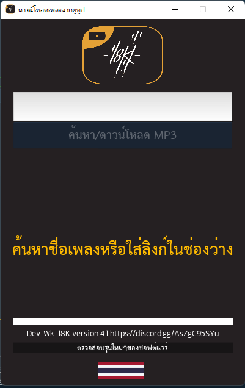
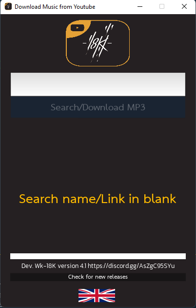

## CHANGELOG
# v 4.1
- Update Localization 2 Language
 

# v 4.0
- Update Add Function Create Short Cut
 
- Support Windows 7 , Windows 10
# v 3.9.1
- Update Add ffmpeg to DIRECTORY in build executable

# v 3.9
- Update Package pytube
# v 3.8
- Update Dropdown Select Bitrate
# v 3.7
- Change UI and Update api pytube fix bug can't download music to finish

# v 3.6
- Fix problem can't download mp3 from youtube
# v 3.5
- Fix problem can't download mp3 from youtube

# v 3.4
- Change API download link youtube to pytube
- Change package for covert mp4 to mp3 with use package ffmpeg
# v.3.3
- fix download slow
# v.3.2
# Added new feature:
- Added Search music for input text
- Added Progress Bar
- New UI Design
### Python-download-YT-MP3-18K-v3.0
- เพิ่มระบบค้นหา youtube ด้วยข้อความ
- เพิ่มระบบคลิกขวาแล้วมีเมนูให้เลือก
### Python-download-YT-MP3-18K-v2.0
- เพิ่มปุ่มเปิดโฟลเดอร์ที่อยู่ของเพลงที่ดาวน์โหลด
- ปรับแต่ง UI
- แสดงรายชื่อเพลงก่อนหน้า
