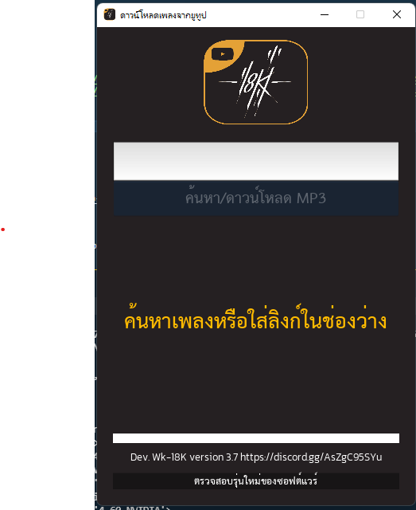
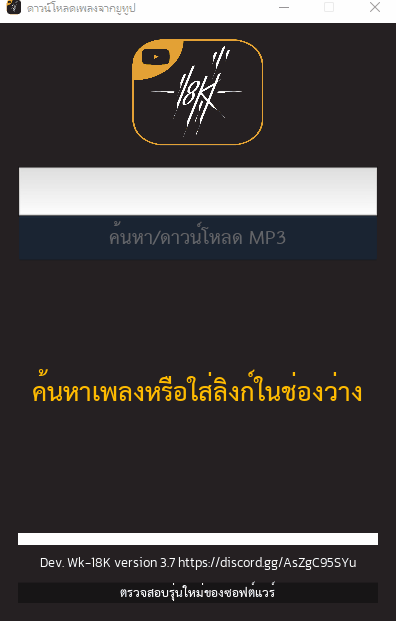

<h2 align="center">🎧 18k-youtube-download 🎧</h2>
<br>

<p align="center">
 <a href="#" align="center"></a> 
  <br>
<a href="#" align="center"></a>
</p>

## 🎈 18k-youtube-download
### A simple project to make gui on kivy mixed with the function of downloading music from youtube with youtube_dl package

### 📌 Requirement
```
pip install -r requirement.txt
```

## 📌 Python 3.9
- https://www.python.org/downloads/release/python-390/


## 🔨 Pip install 
```
pip install kivy
pip install pytube
```

## 💉 Example

<p align="center">
<a href="#" align="center"> </a>
</p>


## How to use
- https://youtu.be/szN09LLOO3E

📌 วิธีลง
- โหลดโปรแกรมที่ https://github.com/watchakorn-18k/Python-download-YT-MP3/releases/
- แตกไฟล์
- จากนั้น หาไฟล์ชื่อ 18k-youtube-download.exe 
📌 วิธีใช้
- เอาลิงก์ youtube มาใส่ รองรับทั้งแบบ youtube.com และ youtu.be
- สามารถค้นหาด้วยชื่อเพลงได้ลเย
- จากกด Download เลย
- จากนั้นรอเพลงโหลดเสร็จ
- เปิดโฟลเดอร์เพลงได้ที่ รูปโลโก้ 18K 

## 📌 Feature version v.3.8
- อัพเดทปุ่มเปลี่ยน Biterate


## CHANGELOG


# v 3.8
- Update Dropdown Select Bitrate
# v 3.7
- Change UI and Update api pytube fix bug can't download music to finish

# v 3.6
- Fix problem can't download mp3 from youtube
# v 3.5
- Fix problem can't download mp3 from youtube

# v 3.4
- Change API download link youtube to pytube
- Change package for covert mp4 to mp3 with use package ffmpeg
# v.3.3
- fix download slow
# v.3.2
# Added new feature:
- Added Search music for input text
- Added Progress Bar
- New UI Design
### Python-download-YT-MP3-18K-v3.0
- เพิ่มระบบค้นหา youtube ด้วยข้อความ
- เพิ่มระบบคลิกขวาแล้วมีเมนูให้เลือก
### Python-download-YT-MP3-18K-v2.0
- เพิ่มปุ่มเปิดโฟลเดอร์ที่อยู่ของเพลงที่ดาวน์โหลด
- ปรับแต่ง UI
- แสดงรายชื่อเพลงก่อนหน้า

